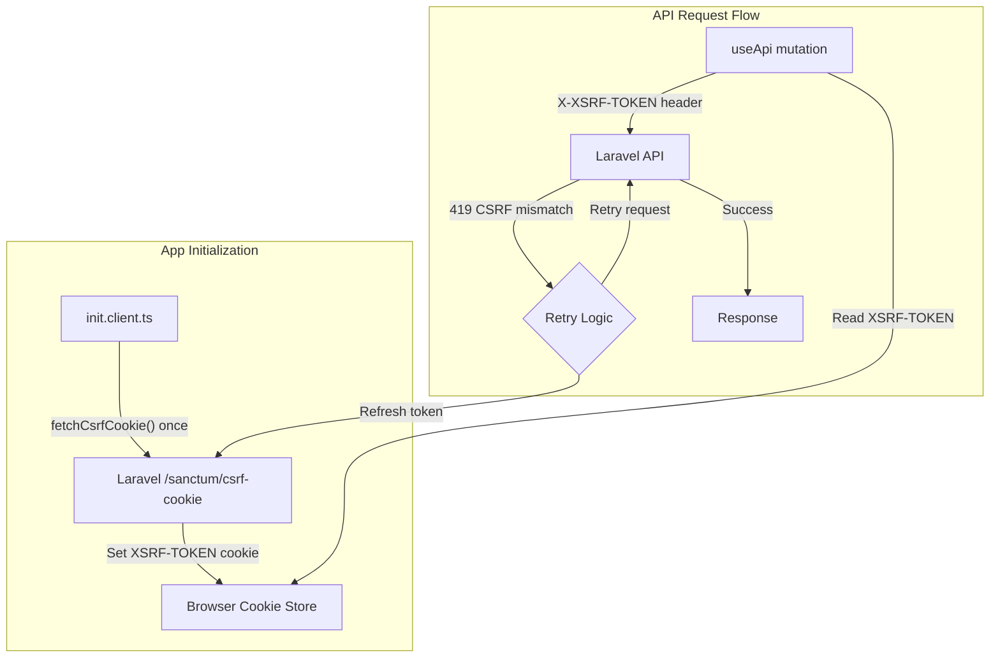

# Plan: Улучшение CSRF/XSRF в useApi

## Текущие проблемы

1. **Дублирование fetchCsrfCookie()** — вызывается и в init.client.ts, и в auth.store.ts для каждой операции
2. **Нет обработки 419 (CSRF token mismatch)** — если токен истёк, запрос падает без retry
3. **Неиспользуемый модуль** — nuxt-auth-sanctum подключен, но не используется (можно удалить)

## Архитектура после изменений

## Изменения

### 1. Удалить nuxt-auth-sanctum из проекта

**Файл:** [nuxt.config.ts](nuxt.config.ts)

- Удалить `nuxt-auth-sanctum` из modules
- Удалить секцию `sanctum` из конфигурации

### 2. Добавить автоматический retry при 419 в useApi.ts

**Файл:** [app/composables/useApi.ts](app/composables/useApi.ts)

- Добавить обработку ошибки 419 (CSRF token mismatch)
- При получении 419: обновить XSRF токен через fetchCsrfCookie() и повторить запрос
- Ограничить retry до 1 раза, чтобы избежать бесконечного цикла

### 3. Удалить дублирующие вызовы fetchCsrfCookie() из auth.store.ts

**Файл:** [app/stores/auth.store.ts](app/stores/auth.store.ts)

- Удалить вызовы `fetchCsrfCookie()` из методов login, register, forgotPassword, resetPassword
- XSRF токен уже получен при инициализации приложения (init.client.ts)
- При 419 useApi() автоматически обновит токен и повторит запрос

### 4. Оптимизировать init.client.ts

**Файл:** [app/plugins/init.client.ts](app/plugins/init.client.ts)

- Добавить флаг для предотвращения повторной инициализации CSRF
- Добавить обработку ошибки сети при получении CSRF cookie

### 5. Добавить функцию проверки валидности XSRF токена

**Файл:** [app/composables/useApi.ts](app/composables/useApi.ts)

- Опционально: проверять время жизни XSRF токена (если известно)